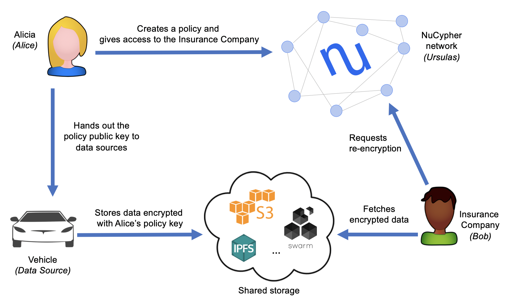

# NuCypher's Vehicle Data Demo



Alicia has a Vehicle with sensors that measure various components and outputs this data in encrypted form. Since she thinks that she may want to share this data in the future, she uses NuCypher to create a _policy public key_ for the Vehicle to use, so she can read and delegate access to the encrypted data as she sees fit. The Vehicle uses this public key to produce a database with some amount of encrypted sensor measurements; this database can be located on some storage service (e.g., IPFS, S3, whatever). 

At some moment, she wants to share this information with other people, such as her Insurance company. Once she obtains her Insurer's public keys, she can create a policy in the NuCypher network granting access to him. After this, her Insurer can read the encrypted database (which was populated by the Vehicle) and request a re-encrypted ciphertext for each measurement, which can be opened with the Insurer's private key.

This simple use case showcases many interesting and distinctive aspects of NuCypher:
  - Alicia can create policy public keys **before knowing** who can be the potential consumers.
  - Alicia, or anyone entity the policy public key (e.g., the Vehicle), can produce encrypted data that belongs to the policy. Again, this can happen before granting access to any consumer.
  - As a consequence of the previous point, Data Sources, like the Vehicle, are completely unaware of the recipients. In their mind, they are producing data **for Alicia**.
  - Alicia never interacts with the Insurer: she only needs the Insurer's public key.
  - Alicia only interacts with the NuCypher network for granting access to the Insurer. After this, she can even disappear from the face of the Earth.
  - The Insurer never interacts with Alicia or the Vehicle: he only needs the encrypted data and some policy metadata.

### How to run the demo
Install dependencies (only for the first time):
```sh
$ pipenv install
```

Run the demo:
```sh
$ pipenv shell

(nucypher)$ python auto_analytics.py
```

* The characters can be viewed at [http://127.0.0.1:8050/](http://127.0.0.1:8050/)
